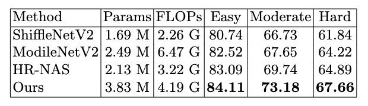
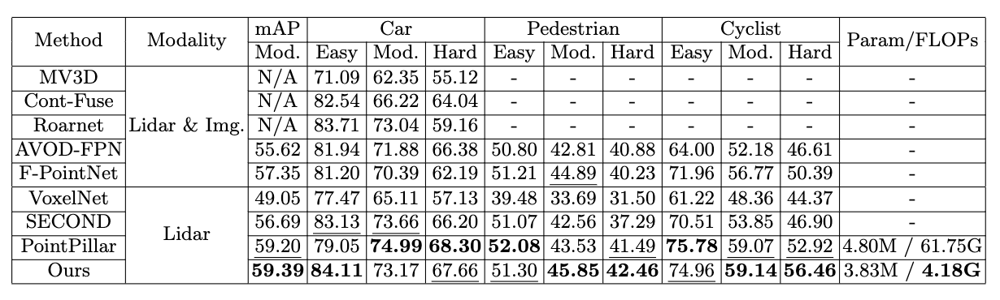
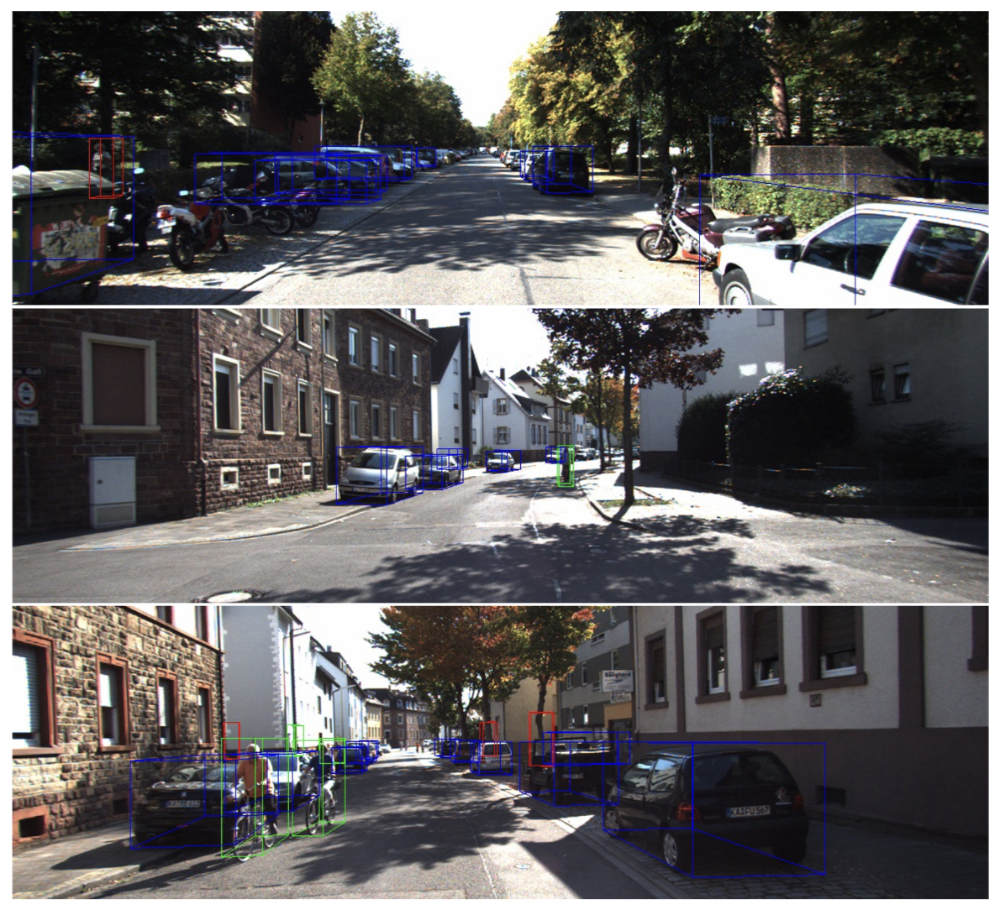

# Neural Architecture Search for 3d Object Detection

## Built Environment

```
sudo docker run -it --name uni3d2 --gpus all --shm-size 8G -p 20001:8888 -v /home/weihua9217/Uni3D:/data nvcr.io/nvidia/pytorch:22.12-py3 bash 
pip install -r requirement.txt
pip install -r requirement_point.txt
pip install opencv-python==4.5.5.64
```

## Dataset

Following this repo to download dataset, and format the dataset.
https://github.com/zhulf0804/PointPillars

```
kitti
    |- training
        |- calib (#7481 .txt)
        |- image_2 (#7481 .png)
        |- label_2 (#7481 .txt)
        |- velodyne (#7481 .bin)
    |- testing
        |- calib (#7518 .txt)
        |- image_2 (#7518 .png)
        |- velodyne (#7418 .bin)
```

## Training

- Using Single GPU

```
CUDA_VISIBLE_DEVICES=0 python -m torch.distributed.launch --nproc_per_node=1 --nnodes=1 --node_rank=0 --master_port=1234 --use_env train_3d.py app:configs/cls_kitti.yml
```

- Using 2 GPU (DDP)
```
CUDA_VISIBLE_DEVICES='0,1' python -m torch.distributed.launch --nproc_per_node=2 --nnodes=1 --node_rank=0 --master_port=1234 --use_env train_3d.py app:configs/cls_kitti.yml
```

## Checkpoint for evaluation
- Download our checkpoint: https://drive.google.com/drive/folders/1-_94ijCvYiCsvYi4FD07sJReb8qqAv3d?usp=sharing
- modify ./cofigs/cls_kitti.yml > set the path of the checkpoint to [resume] in cls_kitti.yml

## Evaluation
```
CUDA_VISIBLE_DEVICES=0 python -m torch.distributed.launch --nproc_per_node=1 --nnodes=1 --node_rank=0 --master_port=1235 --use_env test_3d.py app:configs/cls_kitti.yml
```


## Performance

- Vehicle 3D detection results(AP,%) on the KITTI split1 validation set. FLOPs is calculated for 2D RPN network using an input size of 496 × 432.



- Result on the KITTI validation 3D object detection benchmark (Compare with PointPillar)




## Visualization

- Visualization examples of KITTY validation dataset.
